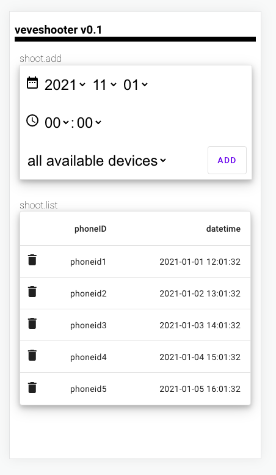

# veveshooter
                          _                 _            
__   _______   _____  ___| |__   ___   ___ | |_ ___ _ __ 
\ \ / / _ \ \ / / _ \/ __| '_ \ / _ \ / _ \| __/ _ \ '__|
 \ V /  __/\ V /  __/\__ \ | | | (_) | (_) | ||  __/ |   
  \_/ \___| \_/ \___||___/_| |_|\___/ \___/ \__\___|_|


Plugin as many android phones as possible and perfom a tap on the buy veve buy button on point.
Configured shoots will be triggered by given date and time.
ALl you need to do is to open the app and browse to the item you want to buy - dont close it needs to stay open.
Now lean back and let the magic happen. =)

<!--  -->

## DEPENDENCIES
+ Python >= 3.5 (Modules: bottle, request, Requests, time, io, csv, httpserver)
+ Bash / Subsystem
+ ADB SDK Platform Tools

## INSTALLATION
Get the source by cloning the repository from git:
```
git clone git@github.com:gemichelst/veveshooter.git && cd veveshooter
```

## CONFIGURATION


## USAGE

## WEB-GUI



## Authors

* **Michael M.** - *BackendDevelopment/Animations/Frontend/Webdesign*
* **Danny B.** - *Conception/Idea*
